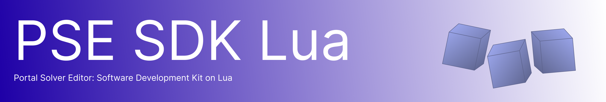

<h1 align="center">PSE SDK Lua</h1>



<div align="center">
  
  
</div>

---

> [!NOTE]
> Это обвязка Fluent API поверх оригинального [PSE SDK](https://github.com/RootTool0/pse-sdk), чтобы облегчить создание уровней и логики. Используется Lua 5.4 Embedded.

> [!IMPORTANT]
> PSE SDK Lua еще стабилен не полностью, будет приятно ждать issue!

### Сборка

**Windows** (MSVC Build Tools (желательно 2022) (Desktop development with C++)):

```cmd
powershell -ExecutionPolicy Bypass -File build.ps1
```

ИЛИ

```cmd
cmake -S . -B build -A x64
cmake --build build --config Release
```

**Linux/MacOS**:
> [!IMPORTANT]
> К сожалению, PSE SDK Lua, а так же Portal: Solver не поддерживают Linux/MacOS из-за использования Windows API - Shared Memory. Используйте эмуляторы.

### Документация

 - [Инициализация](/docs/init/index.md)
   - [MOCK-режим](/docs/init/mock.md)
   - [REPL](/docs/init/repl.md)
 - [Управление игрой](/docs/game.md)
 - [Объекты](/docs/objects/index.md)
   - [Игрок](/docs/objects/player.md)
   - [Сторонние](/docs/objects/third.md)
 - [События](/docs/events.md)
 - [Регистры](/docs/registers.md)
 - [Сводка API](/docs/api.md)


---

<div align="center">
<table width="100%">
  <tr>
    <td align="left" width="45%">
      <a href="#">← Назад: ---</p>
    </td>
    <td align="center" width="10%">
      &nbsp;
    </td>
    <td align="right" width="45%">
      <a href="/docs/init/index.md">Далее: Инициализация →</a>
    </td>
  </tr>
</table>
</div>